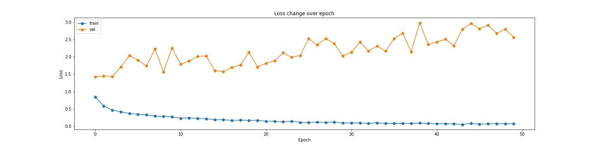

# 腦癌影像辨識  Pytorch

## 內容
- [介紹](#介紹)
- [作品概述](#作品概述)
- [步驟](#步驟)
- [作品成效](#作品成效)
- [總結](#總結)
- [參考資料](#參考資料)

## 介紹
> 此作品是在製作專題時，過程中為了提升模型精確性，所製作的一個有關於Resnet網路對腦癌醫療影像的準確度以及損失值測試。
> 進以將此模型應用於專題(聯邦學習)中，會選擇Resnet的因素是因為其所使用的殘差結構，大大提升了神經網路的深度，
> 解決了傳統卷積神經網路通過一系列卷積層和下採樣層進行堆疊得到的。但是當堆疊到一定網路深度時，就會出現以下兩種問題。 
> 1.梯度消失或梯度爆炸  2.退化問題(degradation problem) 
> 而Resnet在卷積層的歸一化處理(Batch Normalization)以及通過residual結構（殘差結構）
> 可解決這兩個問題，使得網路實現在網路加深，同時也不影響辨識的成效。

## 作品概述
> 此作品中有對resnet-18以及mobilenet_v3_large做測試，一方面比較resnet網路在層數不同時是否有不同表現，
> 另一方面mobilenet系列是借鑑了resnet的優點作為立基在卷積網路上的優化，而mobilenet也有1~3版本，此作品將使用v3
> ，相對於v2，作者在最後層進行了優化，如下圖[[1]](https://machinethink.net/blog/mobile-architectures/ "New mobile neural network architectures")所示， 這樣使網路能夠刪除前面的bottleneck層和depthwise convolution層，而不會降低準確性。

* ___所使用的資料集連結：___ [Brain Tumor Classification (MRI)](https://www.kaggle.com/datasets/sartajbhuvaji/brain-tumor-classification-mri).

## 步驟
> 1. [下載資料](https://www.kaggle.com/datasets/sartajbhuvaji/brain-tumor-classification-mri) 。
> 2. 確認資料集中病徵種類，其中驗證集(val)與測試集(Test)都是從[Testing](./data/Testing)中的資料隨機分割出來的
>    |Type|glioma_tumor|meningioma_tumor|no_tumor|pituitary_tumor|Total|
>    |:-|-:|-:|-:|-:|-:|
>    |Train|826|822|395|827|2870|
>    |Val|-|-|-|-|244|
>    |Test|-|-|-|-|150|
> 3. 調整部分 [ResNet-18](Brain_Tumor_detection_resnet18.ipynb) and [mobilenet](Brain_Tumor_detection_mobilenet_v3_large.ipynb)
>    1. 定義數據集處理方法
>    2. 載入預訓練模型
>    3. 在 Early-stopping 作微調
>       - |超參數||
>         |:-|-:|
>         |學習率|`0.0008`|
>         |批量大小|`64`|
>         |訓練輪次|`50`|
>       - |Loss Function|Optimizer|
>         |:-:|:-:|
>         |`Categorical Cross Entropy`|`Adamax`|
>    5. 訓練過程中損失值以及準確率變化表
>       - |Model|Summary Plot|
>         |:-:|:-:|
>         |ResNet-18||
>         |mobilenet_v3_large||

## 作品成效

<table>
<tr>
<th></th>
<th>ResNet-18</th>
<th>mobilenet_v3_large</th>
</tr>
<tr>
<td>

|__病徵__|
|:-|
|glioma_tumor|
|meningioma_tumor|
|no_tumor|
|pituitary_tumor|

</td>
<td>

|Accuracy|Precision|Recall|F1-Score|
|-:|-:|-:|-:|
|0.7333|0.5556|0.1389|0.2222|
|0.7333|0.7049|0.9556|0.8113|
|0.7333|0.7018|0.9302|0.8000|
|0.7333|1.0000|0.8846|0.9388|
            
</td>
<td>

|Accuracy|Precision|Recall|F1-Score|
|-:|-:|-:|-:|
|0.7133|0.9091|0.2500|0.3922|
|0.7133|0.6618|1.0000|0.7965|
|0.7133|0.6545|1.0000|0.7912|
|0.7133|1.0000|0.5517|0.7111|
            
</td>
</tr>
<tr>
<td>

|:-|
|:-|
|Train set|
|Validation set|

</td>
<td>

|Total Correct Predictions|Total Accuracy|
|-:|-:|
|2870|95.68%|
|244|__94.38%__|

</td>
<td>

|Total Correct Predictions|Total Accuracy|
|-:|-:|
|2870|97.74%|
|244|__95.73%__|

</td>
</tr>
</table>

- [Resnet-18 測試結果](outputs/resnet18_result.csv)
- [mobilenet_v3_large 測試結果](outputs/mobilenet_v3_large_result.csv)

## 總結
> - 準確率上`mobilenet_v3_large`相對高於`Resnet-18`。
> - 計算性能上`mobilenet_v3_large`相對高於`Resnet-18`。
> - 從結果可看出卷積層的優化對於整體神經網路的辨識準確率以及計算性能
> 會有相對的提升。
- 此作品在測量模型仍有不嚴謹之處，僅供參考，日後也會繼續以其他方式評測這兩種模型。

## 參考資料
> - [1] [New mobile neural network architectures](https://machinethink.net/blog/mobile-architectures/).
> - [2] [你必须要知道CNN模型：ResNet](https://zhuanlan.zhihu.com/p/31852747).
> - [3] [轻量级神经网络“巡礼”（二）—— MobileNet，从V1到V3](https://zhuanlan.zhihu.com/p/70703846).
> - [4] Andrew Howard, Mark Sandler, Grace Chu, Liang-Chieh Chen, Bo Chen, Mingxing Tan, Weijun Wang, Yukun Zhu, Ruoming Pang, Vijay Vasudevan, Quoc V. Le, Hartwig Adam. [Searching for MobileNetV3](https://arxiv.org/abs/1905.02244).
> - [5] Kaiming He, Xiangyu Zhang, Shaoqing Ren, Jian Sun. [Deep Residual Learning for Image Recognition](https://arxiv.org/abs/1512.03385). arxiv:1512.03385v1.
> - [6] [Brain Tumor Classification (MRI)](https://www.kaggle.com/datasets/sartajbhuvaji/brain-tumor-classification-mri).